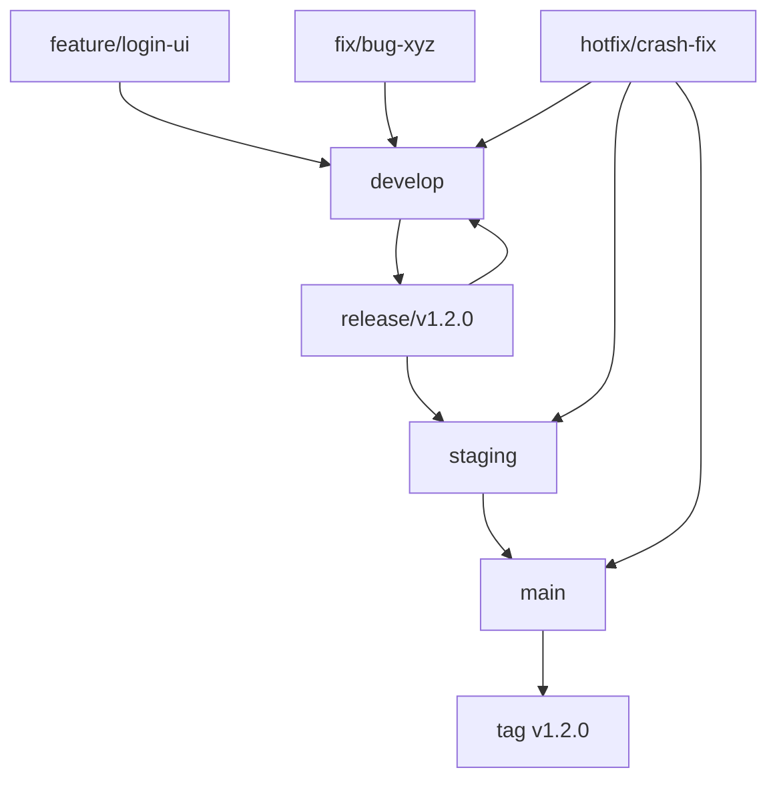

# Code Catalyst

Python アプリケーション開発プロジェクト

## 🌿 ブランチ構成

### 🧱 基本ブランチ

| ブランチ名 | 目的 | 運用ルール |
|------------|------|------------|
| `main` | 本番環境のコードベース | 保護ブランチ。タグ運用（例: `v1.2.0`）。署名付きアプリや公開ビルドに使用。直push禁止。 |
| `develop` | 開発統合用 | 各 `feature/*` ブランチの統合先。単体・結合テストの対象。直接リリースには使用しない。 |
| `staging` | UAT・実機確認用 | `release/*` からマージ。自動アップデート対象。 |
| `release/*` | リリース準備ブランチ | `develop` から分岐。最終調整やQA、リリース検証を行う。 |

### ✍️ 作業ブランチ（トピックブランチ）

| ブランチ名 | 用途 | 命名例 |
|------------|------|--------|
| `feature/*` | 新機能の追加 | `feature/markdown-preview` |
| `fix/*` | バグ修正 | `fix/window-size-restore` |
| `refactor/*` | コード構造の改善 | `refactor/ipc-handler` |
| `test/*` | 技術検証・PoC | `test/ipc-benchmark` |
| `hotfix/*` | 本番環境の緊急修正 | `hotfix/urgent-crash-fix` |

### 📌 ブランチ間マージの原則

当プロジェクトでは、**異なるブランチ間のマージは必ず Pull Request（PR） を通じて行うことを厳守とします。**

#### ✅ 原則ルール

| 作業元ブランチ | マージ先ブランチ | 備考 |
|----------------|------------------|------|
| `feature/*` | `develop` | 機能追加PR |
| `fix/*` | `develop` | バグ修正PR |
| `develop` | `release/*` | リリース準備PR |
| `release/*` | `staging` | UAT用PR |
| `release/*` | `main` | 本番リリースPR |
| `release/*` | `develop` | 差分の開発ブランチ反映PR |
| `hotfix/*` | `main`, `staging`, `develop` | 本番障害対応用PR |

#### ❌ 禁止事項

- `main`, `release/*`, `staging` への**直push**
- CLI/GitHub UI上での直接マージ（PRを介さない `git merge` 等）

#### ❗ 例外対応

CI障害などによるやむを得ない直マージの必要が生じた場合は、**チーム責任者の承認と事前周知**を行ったうえで対応してください。

### 🔁 マージ戦略とフロー

#### 標準マージフロー



#### バグ修正の方針

| 発生フェーズ | 修正対象ブランチ | 修正後のマージ先 |
|-------------|------------------|------------------|
| `release/*` | `release/*` | `staging`, `main`, `develop` |
| `staging` | `release/*` または `fix/*` → `release/*` | 同上 |
| `main`（本番） | `hotfix/*`（`main` から作成） | `main`, `staging`, `develop` |

### 🔄 ブランチ同期ルール

#### `release/*` → `develop`

```bash
git checkout develop
git merge release/v1.2.0
```

#### `hotfix/*` → 他ブランチ

```bash
git checkout main
git merge hotfix/urgent-fix

git checkout staging
git merge hotfix/urgent-fix

git checkout develop
git merge hotfix/urgent-fix
```

### ✅ 保護ブランチ設定

| ブランチ名 | 設定内容 |
|------------|----------|
| `main` | 直push禁止、PRレビュー必須、CI成功必須 |
| `staging` | 同上 |
| `release/*` | 同上（ワイルドカードルールで設定） |

### 🏷 リリースタグルール
- 本番リリース時に `main` に対して `vX.Y.Z` のタグを付与
- タグに対応する GitHub Releases を作成
- 署名付きアプリやWebビルドの参照元として活用

## 🚀 開発環境のセットアップ

### 前提条件

- Python 3.12以上
- Git

### インストール

```bash
# リポジトリをクローン
git clone https://github.com/Kewton/code-catalyst.git
cd code-catalyst

# 仮想環境の作成
python -m venv venv

# 仮想環境の有効化
# macOS/Linux
source venv/bin/activate
# Windows
venv\Scripts\activate

# 依存関係のインストール
pip install -r requirements.txt
```

### テスト実行

```bash
# テストの実行
pytest

# Lintの実行
flake8 .

# セキュリティチェック
bandit -r .
safety check
```

## 📝 コントリビューション

1. このリポジトリをフォーク
2. 新しいブランチを作成 (`git checkout -b feature/amazing-feature`)
3. 変更をコミット (`git commit -m 'Add some amazing feature'`)
4. ブランチにプッシュ (`git push origin feature/amazing-feature`)
5. Pull Request を作成

## 📄 ライセンス

このプロジェクトは MIT ライセンスの下で公開されています。詳細は `LICENSE` ファイルをご覧ください。
