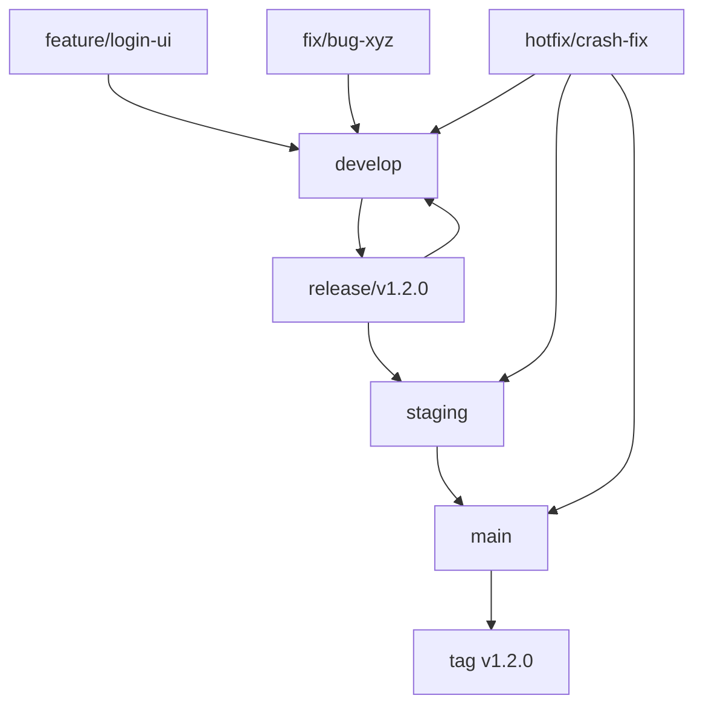

# Code Catalyst

Python アプリケーション開発プロジェクト

## セットアップ
```bash
python -m venv .venv
source .venv/bin/activate  # Windowsの場合: .venv\Scripts\activate
pip install -r requirements.txt
```

## 🌿 ブランチ構成

### 🧱 基本ブランチ

| ブランチ名 | 目的 | 運用ルール |
|------------|------|------------|
| `main` | 本番環境のコードベース | 保護ブランチ。タグ運用（例: `v1.2.0`）。署名付きアプリや公開ビルドに使用。直push禁止。 |
| `develop` | 開発統合用 | 各 `feature/*` ブランチの統合先。単体・結合テストの対象。直接リリースには使用しない。 |
| `staging` | UAT・実機確認用 | `release/*` からマージ。自動アップデート対象。 |
| `release/*` | リリース準備ブランチ | `develop` から分岐。最終調整やQA、リリース検証を行う。 |

### ✍️ 作業ブランチ（トピックブランチ）

| ブランチ名 | 用途 | 命名例 |
|------------|------|--------|
| `feature/*` | 新機能の追加 | `feature/markdown-preview` |
| `fix/*` | バグ修正 | `fix/window-size-restore` |
| `refactor/*` | コード構造の改善 | `refactor/ipc-handler` |
| `test/*` | 技術検証・PoC | `test/ipc-benchmark` |
| `hotfix/*` | 本番環境の緊急修正 | `hotfix/urgent-crash-fix` |

### 📌 ブランチ間マージの原則

当プロジェクトでは、**異なるブランチ間のマージは必ず Pull Request（PR） を通じて行うことを厳守とします。**

#### ✅ 原則ルール

| 作業元ブランチ | マージ先ブランチ | 備考 |
|----------------|------------------|------|
| `feature/*` | `develop` | 機能追加PR |
| `fix/*` | `develop` | バグ修正PR |
| `develop` | `release/*` | リリース準備PR |
| `release/*` | `staging` | UAT用PR |
| `release/*` | `main` | 本番リリースPR |
| `release/*` | `develop` | 差分の開発ブランチ反映PR |
| `hotfix/*` | `main`, `staging`, `develop` | 本番障害対応用PR |

#### ❌ 禁止事項

- `main`, `release/*`, `staging` への**直push**
- CLI/GitHub UI上での直接マージ（PRを介さない `git merge` 等）

#### ❗ 例外対応

CI障害などによるやむを得ない直マージの必要が生じた場合は、**チーム責任者の承認と事前周知**を行ったうえで対応してください。

### 🔁 マージ戦略とフロー

#### 標準マージフロー



#### バグ修正の方針

| 発生フェーズ | 修正対象ブランチ | 修正後のマージ先 |
|-------------|------------------|------------------|
| `release/*` | `release/*` | `staging`, `main`, `develop` |
| `staging` | `release/*` または `fix/*` → `release/*` | 同上 |
| `main`（本番） | `hotfix/*`（`main` から作成） | `main`, `staging`, `develop` |

### 🔄 ブランチ同期ルール

#### `release/*` → `develop`

```bash
git checkout develop
git merge release/v1.2.0
```

#### `hotfix/*` → 他ブランチ

```bash
git checkout main
git merge hotfix/urgent-fix

git checkout staging
git merge hotfix/urgent-fix

git checkout develop
git merge hotfix/urgent-fix
```

### ✅ 保護ブランチ設定

| ブランチ名 | 設定内容 |
|------------|----------|
| `main` | 直push禁止、PRレビュー必須、CI成功必須 |
| `staging` | 同上 |
| `release/*` | 同上（ワイルドカードルールで設定） |

### 🏷 リリースタグルール
- 本番リリース時に `main` に対して `vX.Y.Z` のタグを付与
- タグに対応する GitHub Releases を作成
- 署名付きアプリやWebビルドの参照元として活用

## 🚀 開発環境のセットアップ

### 前提条件

- **Python**: 3.12以上
- **pip**: 最新版
- **Git**: 最新版

### プラットフォーム対応

Code Catalystは以下のプラットフォームをサポートしています：
- **macOS**: x64 / ARM64 (Apple Silicon)
- **Windows**: x64 / ARM64
- **Linux**: x64 / ARM64

### プロジェクト構造

```
code-catalyst/
├── .github/           # GitHub Actions ワークフロー
├── mcp_server/        # MCPサーバー実装
│   ├── server.py      # メインサーバー
│   ├── standalone.py  # スタンドアローンモード
│   ├── logging_config.json  # ログ設定
│   └── logs/          # ログファイル
├── tests/             # テストファイル
├── .gitignore         # Git無視ファイル
├── LICENSE            # ライセンス
├── README.md          # プロジェクト説明
├── CLAUDE.md          # Claude Code開発ガイド
├── pyproject.toml     # プロジェクト設定
└── requirements.txt   # 依存関係
```

### インストール手順

1. **リポジトリのクローン**
   ```bash
   git clone https://github.com/Kewton/code-catalyst.git
   cd code-catalyst
   ```

2. **仮想環境の作成と有効化**
   ```bash
   # 仮想環境の作成
   python -m venv .venv
   
   # 仮想環境の有効化
   # macOS/Linux
   source .venv/bin/activate
   # Windows
   .venv\Scripts\activate
   ```

3. **依存関係のインストール**
   ```bash
   # 本番依存関係のインストール
   pip install -r requirements.txt
   
   # 開発依存関係のインストール
   pip install -e ".[dev]"
   ```

4. **開発環境の確認**
   ```bash
   # コード品質チェック
   flake8 .
   black --check .
   isort --check-only .
   
   # セキュリティチェック
   bandit -r .
   safety check
   
   # テスト実行
   pytest
   ```

5. **MCPサーバーの起動**
   ```bash
   cd mcp_server
   python server.py
   ```

---

## 🔧 開発コマンド

| コマンド | 説明 |
|---------|------|
| `python -m pytest` | テストの実行 |
| `python -m pytest --cov` | カバレッジ付きテスト |
| `python -m pytest -v` | 詳細出力でテスト |
| `flake8 .` | Lintチェック |
| `black .` | コードフォーマット |
| `black --check .` | フォーマットチェック |
| `isort .` | インポート文の整理 |
| `bandit -r .` | セキュリティチェック |
| `safety check` | 依存関係の脆弱性チェック |
| `python mcp_server/server.py` | MCPサーバーの起動（stdio） |
| `python mcp_server/server.py --host 0.0.0.0` | MCPサーバーの起動（TCP） |
| `python mcp_server/standalone.py` | スタンドアローンモード |

---

## 📝 ログ機能

### 構造化ログシステム

Code Catalystでは、Pythonの標準`logging`モジュールを使用した包括的なログシステムを採用しています。

**主な特徴:**
- 複数のログレベル（DEBUG, INFO, WARNING, ERROR, CRITICAL）
- 構造化されたログメッセージ
- ファイル・コンソールへの出力
- ログローテーション機能
- 設定ファイルによるカスタマイズ

**使用例:**
```python
import logging
logger = logging.getLogger("mcp_file_generator")

# 基本的なログ出力
logger.info('MCPサーバーが起動しました')
logger.warning('警告メッセージ')
logger.error('エラーが発生しました', exc_info=True)

# 構造化されたログ
logger.info('ファイル生成完了', extra={
    'module': 'file_generator',
    'action': 'generate_files',
    'file_count': 5,
    'processing_time': 1.23
})
```

**ログ出力先:**
- **開発環境**: コンソール + ファイル (`logs/mcp_server.log`)
- **本番環境**: ファイル (`logs/mcp_server.log`) + エラーファイル (`logs/mcp_server_errors.log`)
- **ログローテーション**: 10MB毎に自動ローテーション、最大5ファイル保持

### ログ設定

MCPサーバーでは設定ファイル（`logging_config.json`）を使用してログの詳細な設定が可能です。

---

## 📊 コード品質保証戦略

### 1. Flake8設定

**主要ルール:**
- PEP 8準拠のコードスタイル
- 未使用変数の検出
- 複雑度チェック
- インポート文の検証

**設定例（pyproject.toml）:**
```toml
[tool.flake8]
max-line-length = 88
extend-ignore = ["E203", "W503"]
exclude = [".venv", "__pycache__", ".git"]
```

### 2. Black設定

**フォーマットルール:**
```toml
[tool.black]
line-length = 88
target-version = ["py312"]
```

### 3. isort設定

**インポート整理:**
```toml
[tool.isort]
profile = "black"
line_length = 88
```

### 4. 開発ワークフロー

```bash
# 開発前のコード品質チェック
flake8 . && black --check . && isort --check-only . && pytest

# 自動修正とフォーマット
black . && isort .

# プルリクエスト前の最終チェック
flake8 . && black --check . && isort --check-only . && pytest && bandit -r .
```

---

## 🧪 テスト戦略

### テストフレームワーク

- **pytest**: テストランナーとアサーション
- **pytest-cov**: カバレッジ測定
- **pytest-mock**: モック機能

### テスト構成

#### 1. 単体テスト (Unit Tests)

**対象範囲:**
- MCPサーバーの各機能
- ファイル生成ロジック
- ユーティリティ関数

**例:**
```python
# tests/test_file_generator.py
def test_parse_markdown_sections():
    """Markdownセクションの解析をテスト"""
    sample_md = """
    ## ./test.py
    ### ./test.py
    ```python
    def hello():
        return "Hello, World!"
    ```
    """
    result = parse_input_md_sections(sample_md)
    assert len(result) == 1
    assert result[0]['filepath'] == 'test.py'
```

#### 2. 統合テスト (Integration Tests)

**対象範囲:**
- MCPサーバーの起動・停止
- ファイル生成の統合フロー
- ログ出力の検証

#### 3. 機能テスト (Functional Tests)

**対象範囲:**
- エンドツーエンドのファイル生成
- リモートTCPサーバー接続
- エラーハンドリング

**テストカバレッジ目標:**
- **ライン カバレッジ**: 80%以上
- **ブランチ カバレッジ**: 75%以上
- **関数 カバレッジ**: 90%以上

### テスト実行環境

```toml
[tool.pytest.ini_options]
testpaths = ["tests"]
python_files = ["test_*.py", "*_test.py"]
python_classes = ["Test*"]
python_functions = ["test_*"]
addopts = "--cov=mcp_server --cov-report=html --cov-report=term-missing"
```

### CI/CD統合

```bash
# GitHub Actions等での実行例
python -m pip install --upgrade pip
pip install -r requirements.txt
pip install -e ".[dev]"
flake8 .
black --check .
isort --check-only .
pytest --cov
bandit -r .
safety check
```

## 📝 コントリビューション

1. このリポジトリをフォーク
2. 新しいブランチを作成 (`git checkout -b feature/amazing-feature`)
3. 変更をコミット (`git commit -m 'Add some amazing feature'`)
4. ブランチにプッシュ (`git push origin feature/amazing-feature`)
5. Pull Request を作成

## 📄 ライセンス

このプロジェクトは MIT ライセンスの下で公開されています。詳細は `LICENSE` ファイルをご覧ください。

## 🤖 MCP Server

このプロジェクトには、構造化されたMarkdownファイルからファイルを生成するためのMCPサーバーが含まれています。

### 機能

- Markdownファイルから複数のファイルを一括生成
- AIエージェントからのリモート実行
- ファイル構造とコンテンツの自動管理

### 使用方法

MCPサーバーは `mcp_server/` ディレクトリにあります。

```bash
# MCPサーバーの起動
cd mcp_server
python server.py

# スタンドアロンでの実行（テスト用）
python standalone.py input.md -d output_directory
```

### MCPクライアントからの使用

```json
{
  "name": "generate_files_from_markdown",
  "arguments": {
    "input_file_path": "/path/to/input.md",
    "root_directory": "/path/to/output"
  }
}
```

詳細は `mcp_server/README.md` をご参照ください。
